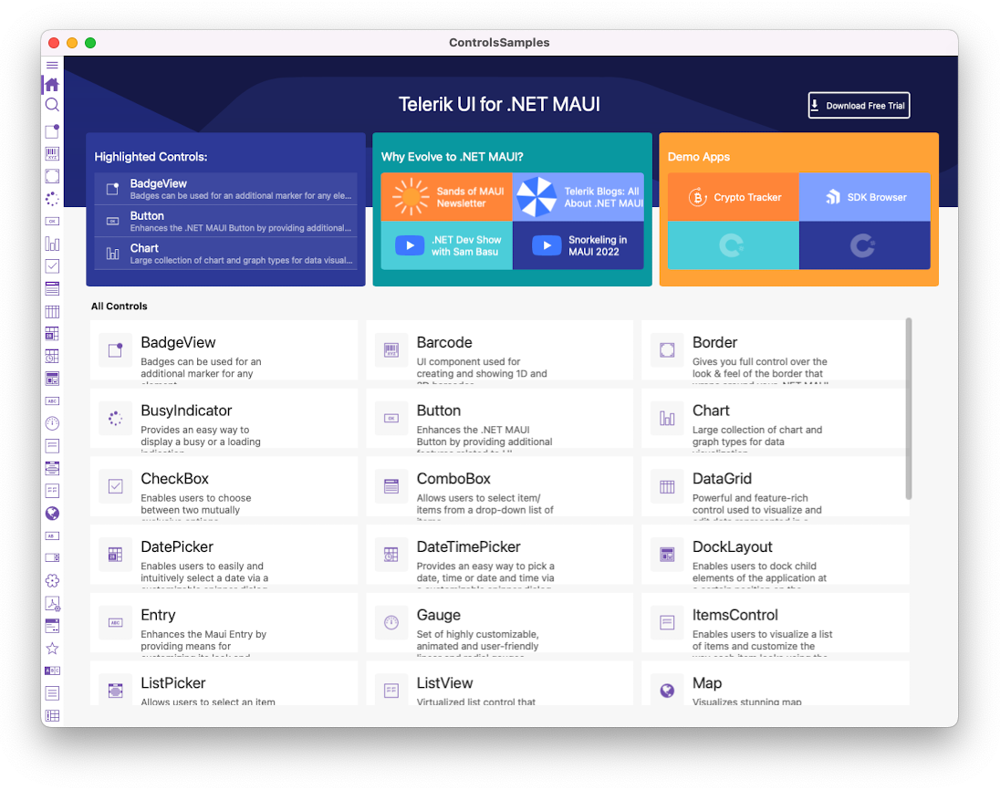
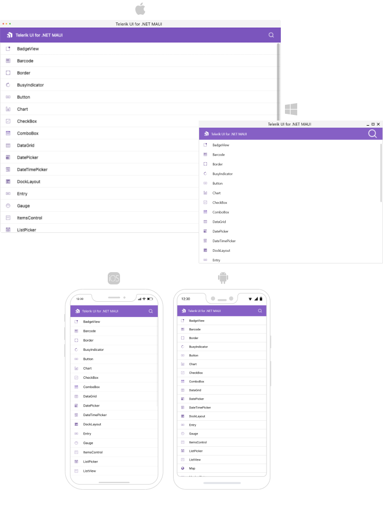

# Telerik UI for .NET MAUI Sample Applications

This repository contains sample applications built with the **Telerik UI for .NET MAUI** components.

## Demos Description

### Crypto Tracker Demo Application

The Telerik Crypto Tracker demo is a cross-platform .NET MAUI application targeting Android, iOS, macOS, and WinUI. It is designed to demonstrate a real-life crypto application that shows changes in cryptocurrency prices, built with the [Telerik UI for .NET MAUI controls](https://www.telerik.com/maui-ui).

You can find more information on the Crypto Tracker Demo Application in the following documentation article: [Crypto Tracker Demo Application](https://docs.telerik.com/devtools/maui/demos-and-sample-apps/crypto-app).

 

## Controls Samples Application

The Telerik UI for .NET MAUI Controls Samples application provides many scenario-specific use cases designed to show off a subset of features for each component.

You can find more information on the Controls Samples Application in the following documentation article: [Controls Samples Application](https://docs.telerik.com/devtools/maui/demos-and-sample-apps/controls-showcase-app).

 

## SDKBrowser Application

The Telerik UI for .NET MAUI SDKBrowser is a set of examples that explain how to use the features of a control. The SDKBrowser shows the components in their pure form without adding extra styling and polishing. It's the go-to source for "how do I use X in Y control". Most of the code snippets available in the documentation are directly generated from the examples in the SDKBrowser (you can see special comments in the code for this).

You can find more information on the SDK Browser Application in the following documentation article: [SDKBrowser Application](https://docs.telerik.com/devtools/maui/demos-and-sample-apps/sdkbrowser-app).

 

## How to Build the Solutions

1. Clone the maui-samples repository on your machine.
1. Install **Telerik UI for .NET MAUI** - you can download it from [here](https://www.telerik.com/maui-ui).
1. Open the corresponding **.sln** file from the cloned repository, for example - [ControlsSamples.sln](/Samples/ControlsSamples/ControlsSamples.sln).
1. Restore the NuGet packages. If the NuGet packages are not automatically restored, add one of the following NuGet package sources:
    * **Telerik NuGet Package Source**&mdash;You can follow the steps from [this article](https://docs.telerik.com/devtools/maui/get-started/windows/first-steps-nuget) for the purpose.
    * **Local NuGet Source**&mdash;:
        1. Copy the full path to the "Packages" folder from the Telerik UI for .NET MAUI installation.
            - For Windows - **C:\Program Files (x86)\Progress\Telerik UI for .NET MAUI 5.2.0\Packages**
            - For Mac - **/Users/&lt;Your User Name&gt;/Documents/Progress/Telerik_UI_for_NET_MAUI_5.2.0/Packages**
        1. Add this path to the `packageSources` collection in the [NuGet.Config](/Samples/NuGet.Config) file. The added entry should look like this:  
        `<add key="PackageSource" value="C:\Program Files (x86)\Progress\Telerik UI for .NET MAUI 5.2.0\Packages" />`
1. Build the app like any other .NET MAUI solution. You can use [this](https://docs.telerik.com/devtools/maui/demos-and-sample-apps/crypto-app) help article for guidance.

## Support and Feedback

You can find the official Telerik UI for .NET MAUI documentation at https://docs.telerik.com/devtools/maui/introduction.

We would love to hear your feedback, so should you have any questions and/or comments, please share them in our [Telerik UI for .NET MAUI Feedback Portal](https://feedback.telerik.com/maui).

The demo applications are also available as offline projects from your Telerik UI for .NET MAUI installation.

## License

See the [license file](LICENSE.md) and any additional license information attached to each sample.